# Work Plan: CV Page (`/cv`)

## Goal

Build a public CV page at `app/cv/page.tsx` that translates the reference HTML (`cv-web.html`) into the existing Next.js + Tailwind + Framer Motion design system. The page must reuse existing tokens, components, and patterns wherever possible. New primitives are created only when nothing existing can be extended.

---

## Non-Negotiable Rules

1. No inline `fontFamily` — use `.font-outfit` / `.font-kode-mono` / `var(--font-*)` classes
2. No new colour definitions outside the 6 declared tokens (see §5)
3. All section spacing uses existing section shell patterns (py-[120px] / max-[900px]:py-[84px])
4. Reuse `CaseStudyLogoStack` for client wall (not a new logo-row component)
5. Reuse `Button` component for all CTAs
6. Gradient text uses `.gradient-text-safe` (never hand-rolled gradient clip)
7. Kicker labels use `.type-kicker` or `.type-kicker-wide` class
8. No image assets committed without existing `/public/images/customers/` match
9. All content in typed data files under `lib/data/cv-*.ts`
10. Server Component by default; `"use client"` only for interactive primitives

---

## Mandatory Audit Table (§4)

| CV-HTML Section | Existing Reuse | Gap / New Piece | Decision |
|---|---|---|---|
| **Top Nav** | Existing site nav (layout.tsx level) | None — page inherits | No new work |
| **Hero** | Hero image pattern (case-study pages) | `CvHeroSection` — unique headline stack + meta-row | New section component |
| **Metric Strip** | `MetricCard` + `GlowCard` | Layout wrapper only (`CvMetricStrip`) | Wrap existing cards |
| **About / Summary** | None exact match | `CvAboutSection` — 2-col prose + pull-quote | New section; uses `.cs-body` token |
| **Experience Timeline** | None exact match | `CvExperienceSection` + `CvTimelineRow` | New section + data-driven row |
| **Experience Ministrip** | `MetricCard` concept (gradient text number) | `MiniMetric` (inline, no card) — or MetricCard `size="compact"` | **Decision: new `MiniMetric` primitive** (simpler than adapting MetricCard which needs GlowCard+CountUp) |
| **Case Studies** | `CaseStudyTeaser` exists (full-width) | Need compact 3-column card variant | **Decision: extend CaseStudyTeaser with `variant="compact"`** via new `CvCaseStudyCard` that composes differently |
| **Client Wall** | `CaseStudyLogoStack` ✓ | Reuse with `showKicker=false`, `showTopBorder`, `showBottomBorder` | Direct reuse |
| **Principles** | `PrinciplesSection` ✓ (hardcoded content) | **Decision: refactor with `principles` data prop** — so CV page can pass different subset or same | Extend existing component with optional prop |
| **Manifesto Block** | Inline in DHL page (~L229-262) + PrinciplesSection (03) | **Decision: extract reusable `ManifestoBlock`** from DHL page pattern | New primitive |
| **Credentials (Awards)** | `AwardBadgesSection` + `CaseStudyLogoStack` + `trust-badges.ts` | New `CvCredentialsSection` — different layout (3-col grid with item lists) | New section; data from `lib/data/cv-credentials.ts` |
| **Skills / Tools** | None | `CvSkillsSection` — pill tag grid | New section component |
| **Final CTA** | `WantTheFullStoryCTASection` ✓ | **Decision: reuse `WantTheFullStoryCTASection`** with CV-specific copy props | Extend props (headline, body text) |
| **Footer** | Site-level footer | None — page inherits | No new work |

---

## Architecture

```mermaid
graph TD
    subgraph "app/cv/page.tsx (Server Component)"
        A[metadata + JSON-LD]
        B[CvHeroSection]
        C[CvMetricStrip]
        D[CvAboutSection]
        E[CvExperienceSection]
        F[CvCaseStudyGrid]
        G[CaseStudyLogoStack — Client Wall]
        H[CvPrinciplesSection]
        I[CvCredentialsSection]
        J[CvSkillsSection]
        K[WantTheFullStoryCTASection]
    end

    subgraph "Primitives (components/ui)"
        M[MiniMetric — new]
        N[ManifestoBlock — extracted]
        O[MetricCard — existing]
        P[GlowCard — existing]
        Q[Button — existing]
    end

    subgraph "Data (lib/data)"
        R[cv-experience.ts]
        S[cv-metrics.ts]
        T[cv-skills.ts]
        U[cv-credentials.ts]
        V[cv-case-studies.ts]
        W[cv-principles.ts]
    end

    E --> M
    E --> R
    C --> O
    C --> S
    H --> N
    H --> W
    I --> U
    J --> T
    F --> V
```

---

## Key Decisions

| # | Decision | Rationale |
|---|---|---|
| 1 | New `MiniMetric` instead of `MetricCard size="compact"` | MetricCard bundles GlowCard + CountUp + large text. Ministrip needs inline 26px gradient numbers — simpler dedicated primitive avoids prop explosion |
| 2 | New `CvCaseStudyCard` (compact card) vs extending `CaseStudyTeaser` | CaseStudyTeaser is a full-width 2-column layout. CV needs 3-col image cards. Different enough to warrant own component, but reuses same data shape |
| 3 | `PrinciplesSection` receives optional `principles` prop | Keeps backward compat (home page uses defaults). CV page passes subset |
| 4 | `ManifestoBlock` extracted from DHL page | Same pattern used 3× (DHL, PrinciplesSection #03, CV). Extract once, reuse everywhere |
| 5 | `WantTheFullStoryCTASection` reused for CV CTA | Already has configurable headline/body/buttons. Just pass CV-specific text |
| 6 | 6 new tokens added to `globals.css` | See Phase 01 |

---

## 6 New Tokens (globals.css additions)

| Token | Purpose | Value |
|---|---|---|
| `--cv-rule` | Timeline border colour | `rgba(255,255,255,0.08)` (alias `var(--rule)` from HTML) |
| `--cv-rule-strong` | Hover/active border | `rgba(255,255,255,0.16)` |
| `.cv-pull-quote` | Left-border gradient pull-quote | `border-image: linear-gradient(180deg, #22d3ee, #3b82f6) 1` |
| `.cv-timeline-year` | Large year numeral (Outfit 200, clamp) | Typography composition class |
| `.cv-ministrip-value` | 26px gradient number (italic 800) | Compact gradient text |
| `.cv-tag-pill` | Skill pill chip | `border-radius:999px; padding:7px 14px; border:1px solid var(--rule)` |

---

## Risks & Mitigations

| Risk | Impact | Mitigation |
|---|---|---|
| **Content guardrails** — "10-12 days" stat on public URL | Could be interpreted as notice period commitment | Use "Available in 10-12 days" with tooltip/footnote clarifying it's indicative |
| **Education not shown** | CV reference omits formal education entirely | Do NOT add education section — mirrors reference. If challenged: Stefan's UX Master cert covers credential proof |
| **"5 ventures" claim** — verifiable? | Potential recruiter scrutiny | Ensure "Founded 5 ventures" links to portfolio or about page context |
| **Client logos missing from `/public`** | Build-time Image 404s | Client wall reuses only logos already in `/public/images/customers/` (19 available). Skip any from HTML not present |
| **Sensitive salary/availability detail** | Reference HTML has no salary info | Keep out of scope |
| **SEO: /cv page indexed** | Currently only homepage in sitemap | Add /cv to sitemap.ts with proper metadata + JSON-LD (ProfilePage schema) |

---

## Content Guardrails (§7)

- **No salary expectations** on page
- **No exact start date** — use "Available" language only
- **No NDA-covered project details** beyond what's on portfolio
- **No personal contact beyond email** (no phone, no address beyond city)
- **Metric claims must match existing portfolio** — cross-ref with DHL/Saloodo page
- **"15+ years"** is the canonical timeframe (2011 → 2026)

---

## Out of Scope

- Dark/light mode toggle (site is dark-only)
- Print stylesheet (separate future task)
- Animated page transitions between /cv and other pages
- Download-as-PDF button
- Languages section (not in reference)
- Hobbies/interests section (not in reference)
- Custom nav for /cv (uses site nav)
- Mobile hamburger menu changes

---

## Acceptance Criteria

- [ ] `npx next build` completes without error
- [ ] `npx next lint` passes
- [ ] `/cv` renders all 10 sections from reference HTML
- [ ] All text content matches `cv-web.html` reference (no placeholder text)
- [ ] No new `fontFamily` inline styles
- [ ] No colour values outside design tokens
- [ ] Client wall uses only logos from `/public/images/customers/`
- [ ] `app/sitemap.ts` includes `/cv` entry
- [ ] Page `<head>` has CV-specific OG tags + JSON-LD
- [ ] Lighthouse performance score ≥ 90 on mobile
- [ ] No client-side JS for static sections (Server Components)
- [ ] All data lives in `lib/data/cv-*.ts` files
- [ ] Responsive: 320px → 1440px without horizontal scroll

---

## Phase Overview

| Phase | File | Summary |
|---|---|---|
| 01 | [phase-01-audit-and-tokens.md](./phase-01-audit-and-tokens.md) | Add 6 CSS tokens to globals.css |
| 02 | [phase-02-types-and-data.md](./phase-02-types-and-data.md) | TypeScript types + data files for all CV content |
| 03 | [phase-03-primitives.md](./phase-03-primitives.md) | MiniMetric, ManifestoBlock, CvCaseStudyCard |
| 04 | [phase-04-sections.md](./phase-04-sections.md) | All CV section components |
| 05 | [phase-05-page-composition.md](./phase-05-page-composition.md) | app/cv/page.tsx assembly |
| 06 | [phase-06-seo-sitemap-qa.md](./phase-06-seo-sitemap-qa.md) | SEO metadata, sitemap, JSON-LD, QA |

---

## Ready to implement?
